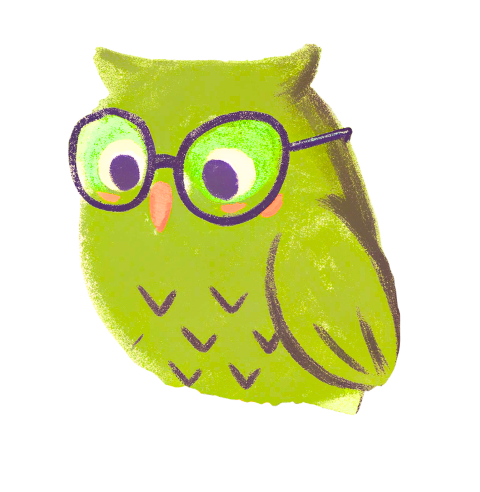

# Study Lounge

<div align="center">
  
</div>

<br>

<div align="center">

**A modern English language school landing page** — helping students conquer BAC, IELTS, TOEFL, and beyond.
From primary school kids taking their first English steps, to working professionals pursuing Business English or IELTS certification, the school offers a tailored path for everyone.

[](https://studylounge.vercel.app)

</div>

---

## Tech Stack

| Technology | Purpose |
|---|---|
| HTML5 | Semantic page structure |
| Vanilla CSS | All styling — no frameworks |
| Reset.css | Cross-browser style normalization |

---

## Screenshots

### Why Us

Highlights the school's core strengths, such as a certified teacher, small group sizes, flexible scheduling, and a proven track record of exam success. Real numbers at a glance.


### Courses

A card-based catalogue covering every programme offered from BAC preparation, IELTS & TOEFL, Business English, General English for adults and children, and Medical English. 


### About

Introduces teacher Adriana.


---

## Mobile View

The layout is fully responsive, with the navigation collapsing to a hamburger menu.

<div align="center">
  
</div>

---

## Mascot — Oli

> 
>
> Meet **Oli** — the friendly face of Study Lounge. Oli is always around to cheer students on, keeping the vibe fun and encouraging throughout every lesson and milestone!

<br>

---

## Project Structure

```
study-lounge-web/
├── index.html
├── style.css
├── reset.css
└── assets/
    ├── img/
    └── svg/
```

---

## Course

Built for the **Web Programming** course at [Technical University of Moldova](https://utm.md).
